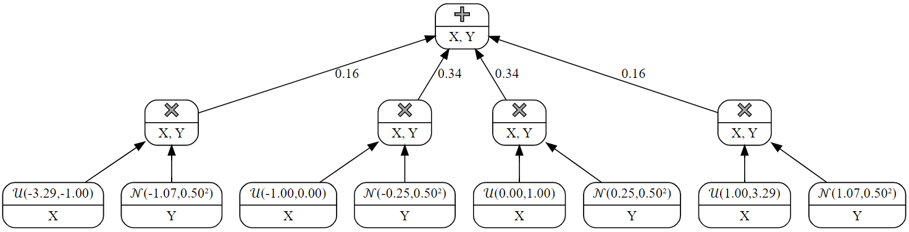
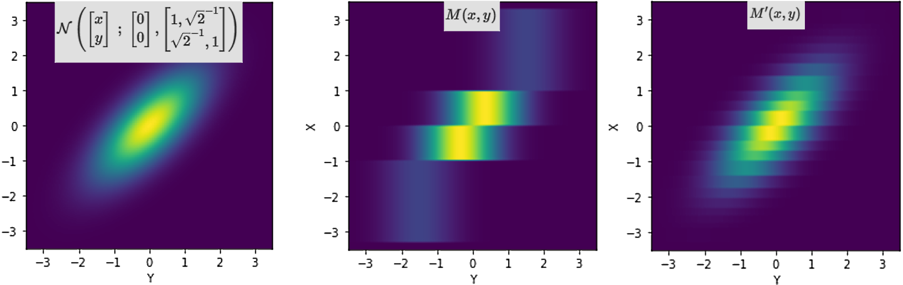

# Hi (Work in progess)
### **ABSTRACT**

Probabilistic Circuits (PCs) provide a clear framework for tractable exact integration over probability distributions. Sum-Product-Networks (SPNs) are an instance of these, being able to represent any arbitrarily deep composition and factorization of mixture models. Bayesian Networks (BNs) have long been known for their explainability by expressing joint distributions and characterization of independence, but generally lack effective inference procedures. By translating BNs into SPNs, we get the best of both worlds: Tractable inference, explainability, and preserved independence structures.

### **CONTRIBUTION OF THE PAPER**

We investigate and show how to compile a bayesian network of Linear Gaussian Conditional Probability Distributions (LGCPDs) into a SPN. Inspired by this, we give a more general algorithm and framework for compiling any bayesian network over continuous variables into a SPN with arbitrarily high precision, and give a qualitative and quantitive evaluation and analysis of the procedure and its limitations.

### **PREREQUISITES and NOTATION**

#### **Bayesian Networks and the Linear Gaussian Conditional Probability Distribution**

- What is a Bayesian Network? Brief rundown and mention of inference algorithms and runtimes. What are costs associated with marginalisation and maximisation?

- Give the pdf of a linear Gaussian CPD and the properties of composing them. Put weight on closed form marginalisation and easy maximisation. 

$\mathcal{N}(x \;;\; µ_x,\sigma_x^2)$ denotes the PDF(x) of the normally distributed random variable X with mean $\mu_x$ and standard deviation $\sigma_x^2$.

$\underset{(a,b]}{\mathcal{U}}(x)$ denotes the PDF(x) of the uniformly distributed random variable X with support $(a,b]$ and density $1/(b-a)$.

Functions composed of valid Sum-, Product- and Leaf-units will be denoted $M(x_{1:n})$ for model.

#### **What are Sum-Product-Networks (SPNs) and Probabilistic Circuits?**

  - Deep mixture models specified as computational graphs
  - Describe the three types of nodes, relevant structural properties
  - Recursive algorithms for inference, linear cost in amount of nodes
  - Show a small example of the computational graph of a simple SPN.

### **THE APPROACH**

Compiling (translating) a bayesian network into a SPN is essentially asking the question: How can we choose the function $M$ such that $P(x_1)\cdot P(x_2|x_1) \cdot ... \cdot P(x_n|x_{1:n-1})$ into $M(x_{1:n})$, where $M$ belongs to the following grammar, which defines the structure of a valid SPN:

$$
\begin{align*}M(x_{m:n}) & \xrightarrow{} \; \text{Leaf}(x_{m:n})
\\
&\hspace{10px}|\hspace{4px}\;\sum_{i=1}^k \theta_i \cdot M(x_{m:n}) \hspace{14px} \text{where  } \sum_{i=1}^k{\theta} = 1
\\
&\hspace{10px}|\hspace{4px}\;\prod_{P_i \in P} M(x_{P_i}) \hspace{35px}\text{for  } P \in \text{Partitions}(\{m, m+1,...,n\})
\end{align*}
$$

#### **Explaining the need for an approximation**

The faithful bayesian network $X \xrightarrow{} Y$ will be our recurring example in this section. This structure gives rise to the factorization of the joint pdf into $p_{X,Y}(x,y) = p_X(x) \cdot p_{Y|X}(y|x)$. There will be no assumptions on X and Y except that they are continuous.

If we restrict ourselves to one-dimensional leaves[^one-dimensional-leaves], it should be clear that we cannot construct $M$ from this grammar such that

$$M(x,y) = p_X(x) \cdot p_{Y|X}(y|x)$$

because our grammar restricts us from to multiplying dependent terms (because of the partition requirement). The right hand side of the product will always depend on both $x$ and $y$, whereas the left only depends on $x$. More generally, we therefore cannot hope to exactly capture any interesting [^interesting-distribution] factorized distribution because at least some of the terms in the product will have overlapping scope.

[^one-dimensional-leaves]: Why not just use a single all-encompassing multivariate leaf? Yes, you could make one big leaf to capture the entire join distribution, after which we would have offloaded all the integration problems to our leaf. In the hopes of generalize to any continuous joint distribution, we will refrain from doing this.

[^interesting-distribution]: We call it an interesting distribution when there exists some pair of correlated variables. If they are all independent, the bayesian network would be a bunch of disjoint nodes, and the factorization would be uninteresting, and the first SPN that comes to mind would be trivial, $M(x_{1:n}) = \prod_{i=1}^n pdf_{x_i}(x_i) $

#### **The approximation approach**
Have we failed? No. We just have to lower our expectations. We have proven that we cannot exactly translate even a simple, two node bayesian network into a SPN. We will have to make due with an approximation.

One helpful takeaway from the previous section is that we cannot capture covariances with the product-unit. Since we refuse to offload all the work onto the leaf-units, we will have to use sum-nodes to create a correlation between our variables.

Let's motivate our final chosen approach by starting off with the following observation, where $\delta_a(x)$ denotes the dirac delta function centered at $a$:

$$p_X(x) \cdot p_{Y|X}(y|x) = \underset{Domain(X)}{\int}\delta_t(x)\cdot p_X(t)\cdot p_{Y|X}(y|X=t) \; dt $$

by the integral-extraction properties of $\delta_a(x)$. However, the mixtures in SPNs are finite, so they cannot capture this. We can however, approximate the integral with a sum-unit, and replace the delta with an indicator function. This gives the following valid model instead.

$$
\begin{align*} &\approx M(x,y) = \sum_{[a, b]\in P} \mathbf{1}(a\lt x\leq b)\cdot p_X\left(\frac{a+b}{2}\right)\cdot p_{Y|X}\left(y\;|\;X=\frac{a+b}{2}\right)
\\
& \hspace{73px}\text{where  } P \in \underset{\text{}}{\text{Partitions}}(Domain(X))
\end{align*}
$$

Notice that $$\mathbf{1}(a\lt x\leq b)\cdot p_X(\frac{a+b}{2}) \propto \underset{(a,b)}{\mathcal{U}}(x)$$ so we can rephrase this as

$$
= \sum_{[a, b]\in P} \theta(a,b) \cdot \underset{(a,b]}{\mathcal{U}}(x)\cdot \text{Leaf}(y, a, b)
\\
\text{for  } \theta(a,b) := (b-a) \cdot p_X(\frac{a+b}{2})
\\
\text{and  } \text{Leaf}(y, a, b) := p_{Y|X}\left(y\;|\;X=\frac{a+b}{2}\right)
$$

This is expression is fully compatible with the SPN framework, assuming a finite partition of the domain of X. 

---

***Example:*** Let our bayesian network be a Linear Gaussian CPD with factorized joint distribution given as

$$ \mathcal{N}(x \;;\; 0,1^2) \cdot \mathcal{N}(y \;;\; x,0.5^2) = \mathcal{N}\left(\begin{bmatrix}x\\y\end{bmatrix} \;;\; \begin{bmatrix}0\\0\end{bmatrix},\begin{bmatrix}1, \sqrt{2}^{-1}\\ \sqrt{2}^{-1}, 1\end{bmatrix}\right) $$

To translate this to the SPN $M(x,y)$, we need to ensure a bounded domain, so we truncate the gaussians at their 1/1000th quantiles. For our chosen partition \{(-3.29,-1), (-1, 0), (0, 1), (1, 3.29)\}, we get the following SPN: 

Is this is a two dimensional joint distribution, we can also plot the density as a heatmap. Below, from left to right, are the true density given by the pdf, the density induced by the above SPN, and a second SPN $M'(x,y)$, which is built from a finer partition of the truncated domain of $X$.

---
We have successfully approximated the integral into SPN language, as the above is a finite mixture of univariate leaf nodes. In the limit, as we increase the cardinality of our partition, we arrive at the integral, and can therefore achieve arbitrary (localized) precision.

- Distributions are parametrized by their parent's (random) outcome, so we have to take that into account.
- Will have to "bin" RVs whose outcomes determine child distributions.

#### **Cases to consider**

Show images with each case.

- Single node [Leaf node]
- Independent nodes [Product node with leaf per factorization]
- Dependent nodes
  - Parent-Child relationship [mixture of ["binned" parent multiplied with child distribution (as SPN) given parent took central bin value]]
    - Multiple children [easy, they are conditionally independent given their parents, just multiply them together]
    - Multiple parents [hard, mixture of [cartesian product of parents' bins multiplied by child SPN given parents]]

#### **Discretization procedure**

- Describe mathematically the three techniques.
- Compare their KL divergences.

#### **Properties of the SPN**

- Bounds on the joint likelihood and stronger bounds on marginal likelihoods (if BN leaves are marginalized out).
- How does scale grow with epsilon? Exponentially? Show.
- Show how samples approximately follow the same distribution

#### **LIMITATIONS**

- 0th order taylor approximation
- not differentiable

### **GENERALIZING TO ANY CONTINUOUS JOINT DISTRIBUTION**

### **The slopyform distribution (one piece of a piecewise linear?)**

- Give parameters, mean, variance, pdf, cdf

- This results in a SPN whose inference outputs are differentiable w.r.t. the parameters of the bayesian network.
  - The joint likelihood was already optimizable, no SPN needed.
  - marginal likelihood is now differentiable
  - CDF is now differentiable (and the inverse?)
  - With inverse CDF is differentiable, can use reparametrization trick, to optimize stochastic objective (autoencoders training for example, but underlying latent space with interpretable BN PD)

#### Differences to Uniforms

- Syntax

- The different network-structure cases are treated the same way.
  - However, as we do not have any closed form leaf distributions but the slopyform, we must also discretize independent nodes of the BN.

- The difference comes from how we specify the network and how we discretize.
  - Discretize evenly within bounds
  - Compute slope with automatic differentiation (retain graph)

### **FUTURE WORK**

- Rewriting in low-level language for performance gains
- Condition children on piecewise linear mean instead of domain mean.

### **CONCLUSION**
- Don't do it if you know the closed form solution.

Should everything go into the project?
Distil the most important parts, #paragraphs does not have to be proportional to work put in.
~15 pages
writing style comes second to knowledge transfer
signposting... "intuitively.." to signify explanation section clear distinction between intuition and formalism
no storytelling, don't have to
give motivation
will wirte approx twice as much, less is more, cut sections, condense sentences
skippable sections