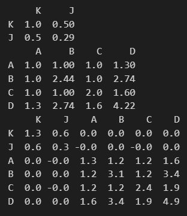

# relevant sample of thesis
### **ABSTRACT**

Sum-Product networks (SPNs) are a deep architecture capable of modeling joint distributions supporting tractable exact integration. Bayesian networks (BNs) allow for direct modeling of independencies and relationships between variables, but integrating them (say, to normalize) is generally intractable. In this thesis, we propose an approach of compiling BNs into SPNs, that is, capturing the distribution of one model in another to leverage the advantages of both frameworks. By doing so we achieve tractable integration in a SPN that simultaneously captures a BN’s relationships and independencies.

### **CONTRIBUTION**

My work focuses on investigating and motivating a methodology for compiling Bayesian networks with the structure X → Y into SPNs. We then present the compilation of complex yet tractable linear Gaussian graphical probabilistic models into SPNs, providing a comparative analysis of the resulting representations. Following these results I present a generalized algorithm and framework for compiling any BN with continuous variables bounded to a finite interval into a SPN.

### **THE APPROACH**

Compiling (translating) a bayesian network into a SPN is essentially asking the question: How can we choose the function $M$ such that $P(x_1)\cdot P(x_2|x_1) \cdot ... \cdot P(x_n|x_{1:n-1})$ into $M(x_{1:n})$, where $M$ belongs to the following grammar defining the structure of a valid SPN:

$$
\begin{align*}
S & \xrightarrow{} \ M(x_{m:n})
\\
M(x_{m:n}) & \xrightarrow{} \ \text{Leaf}(x_{m:n})
\\
&\hspace{10px}|\hspace{4px}\ \sum_{i=1}^k \theta_i \cdot M(x_{m:n}) \hspace{14px} \text{where  } \sum_{i=1}^k{\theta} = 1
\\
&\hspace{10px}|\hspace{4px}\ \prod_{P_i \in P} M(x_{P_i}) \hspace{35px}\text{for  } P \in \text{Partitions}(\{m, m+1,...,n\})
\end{align*}
$$

#### **We will have to make do with an approximation**


The faithful bayesian network $X \xrightarrow{} Y$ will be our recurring example in this section. This structure gives rise to the factorization of the joint pdf into $p_{X,Y}(x,y) = p_X(x) \cdot p_{Y|X}(y|x)$. There will be no assumptions on X and Y except that they are continuous.

If we restrict ourselves to one-dimensional leaves[^one-dimensional-leaves], it should be clear that we cannot construct $M$ from this grammar such that

$$M(x,y) = p_X(x) \cdot p_{Y|X}(y|x)$$


because our grammar restricts us from to multiplying dependent terms (because of the partition requirement). The right hand side of the product will always depend on both $x$ and $y$, whereas the left only depends on $x$. More generally, we therefore cannot hope to exactly capture any interesting [^interesting-distribution] factorized distribution because at least some of the terms in the product will have overlapping scope.

[^one-dimensional-leaves]: Why not just use a single all-encompassing multivariate leaf? Yes, you could make one big leaf to capture the entire joint distribution, after which we would have offloaded all the integration problems to our leaf. In the hopes of generalize to any continuous joint distribution, we will refrain from doing this.

[^interesting-distribution]: We call it an interesting distribution when there exists some pair of correlated variables. If they are all independent, the bayesian network would be a bunch of disjoint nodes, and the factorization would be uninteresting, and the first SPN that comes to mind would be trivial, $M(x_{1:n}) = \prod_{i=1}^n pdf_{x_i}(x_i)$

#### **The approximation approach**

Have we failed? No. We just have to lower our expectations. We have proven that we cannot exactly translate even a simple, two node bayesian network into a SPN. We will have to make due with an approximation.

One helpful takeaway from the previous section is that we cannot capture covariances with the product-unit. Since we refuse to offload all the work onto the leaf-units, we will have to use sum-nodes to create a correlation between our variables.

Let's motivate our final chosen approach by starting off with the following observation, where $\delta_a(x)$ denotes the dirac delta function centered at $a$:


$$p_X(x) \cdot p_{Y|X}(y|x) = \underset{\text{Domain}(X)}{\int}\delta_t(x)\cdot p_X(t)\cdot p_{Y|X}(y|X=t) \; \text{d}t $$

by the integral-extraction properties of $\delta_a(x)$. However, the mixtures in SPNs are finite, so they cannot capture this. We can however, approximate the integral with a sum-unit, and replace the delta with an weighted indicator function. This gives the following valid model instead, for some $P \in \underset{\text{}}{\text{Partitions}}(\text{Domain}(X))$.

$$
\approx M(x,y) = \sum_{(a, b]\in P} \frac{\mathbf{1}(a\lt x\leq b}{b-a}\cdot \frac{p_X\left(\frac{a+b}{2}\right)}{Z} \cdot p_{Y|X}\left(y\;|\;X=\frac{a+b}{2}\right)
\\\
\ \ \text{for  } Z = \sum_{[a, b]\in P} p_X\left(\frac{a+b}{2}\right)
$$

Since $\frac{\mathbf{1}(a\lt x\leq b)}{b-a} = \underset{(a,b]}{\mathcal{U}}(x)$, we can rephrase this as

$$
= \sum_{[a, b]\in P} \underbrace{\frac{p_X\left(\frac{a+b}{2}\right)}{Z}}\_{\text{normalized weights}} \cdot \underbrace{\underset{(a,b]}{\mathcal{U}}(x)}\_{\text{Leaf with scope $x$}}\cdot \underbrace{p_{Y|X} \left(y\;|\;X=\frac{a+b}{2}\right)}\_{\text{Leaf with scope $y$}}
$$

The above expression is fully compatible with the SPN framework, as it is a finite mixture of products of independent leaf nodes. As we increase the cardinality of our partition, we get better point-wise precision.The only assumption used is, that a finite partition of the domain of X exist. This highlights another limitation of this translation procedure: The resulting SPN can never induce a distribution with infinite support.

### **The slopyform distribution (one piece of a piecewise linear)**

The slopyform distribution $\mathcal S((a,b],s)$ is similar to the uniform distribution. The support runs continuously from $a$ to $b$, but within that however, it has constant derivative $s$, with $\vert s\vert \leq \frac{1}{2(b-a)^2}$ to ensure nonnegativity. Intuitively, you can imagine it as a uniform with a slanted top. Let $X \sim \mathcal S((a,b],s)$. Then:

$$\text{PDF}(x) =
\begin{cases}
\left(x-a\right)\cdot s+\frac{1-\frac{1}{2} s\cdot \left(b-a\right)^{2}}{b-a} & a\lt x\le b 
\\
 0 & \text{otherwise} 
\end{cases}
$$

$$\mathbb{E[X]} = \frac{a+b}{2} - \frac{(a-b)^3}{12}s$$

$$\text{Var}[X] = \frac{(b-a)^3}{6}s$$

$$P(X\lt x) = \begin{cases}
0 & x\le a
\\
 \frac{\left(s\cdot \left(b-x\right)\cdot a+2-b\cdot \left(b-x\right)\cdot s\right)\cdot \left(a-x\right)}{-2\cdot b+2\cdot a} & \text{otherwise}
\\
 1 & b\lt x
\end{cases}$$

## **Example of compiling a LGPGM to a SPN**

Defining a LGPGM is pretty intuitive.

```python	
from lgpgm import noise

A = "A" @ noise  # noise is an i.i.d. gaussian with mean 0 and variance 1. The @ operator assigns a name to the variable.
B = "B" @ (A + 1.2*noise + 1) # They can be composed with other variables, and more noise can be added.
C = "C" @ (A + noise + 4)
D = "D" @ (B + 0.3*C + noise - 5)

K = "K" @ (noise - 6)
J = "J" @ (0.5 * K - 3 + 0.2*noise)
A & K # Here, we join the two pgms, which have no connecting edges between them.
display(A.get_graph(detailed=False))
display(A.get_graph(detailed=True))
```


We can construct an SPN approximating this multivariate normal with the following code.

```python
import spnhelp

spn = spnhelp.lgpgm_to_spn(A, crit=spnhelp.CRIT_bounded_deviation, crit_param = 0.1, sloped=False) # eps can be lowered to get a better approximation
spnhelp.plot_marginals(spn, A)
print(get_number_of_nodes(spn), "nodes, with depth of", get_depth(spn))
```


Now, let's try and sample from it to see how well it captures the covariance:

```python	
scope = A.get_scope(across_factors=True)
print(K.get_Σ()) # printing the true covariance 
print(A.get_Σ()) # printing the true covariance
samples = spnhelp.sample_from_spn(spn, 10000) # sampling from the spn
cov = np.cov(samples, rowvar=False).round(1) # computing covariance of the samples
print(pd.DataFrame(cov, index=scope, columns=scope))
```



The covariance is pretty close to the true covariance. It would be better with a lower epsilon, but this is just a toy example and it grows exponentially in size with decreasing epsilons. The mean will be captured perfectly (not shown here).


### **Qualitative comparison of the approaches**

One can approximate gaussians by a mixture of uniforms or slopyforms, both with disjoint support. The library allows one to give error bounds that the approximation should fall within, here are two kinds shown below. A slopyform is a uniform distribution with a likelihood proportional to the input.


Multiplying two of these approximations together gives us our first simple SPN of a factorized model, using the following Bayesian network:
```python
A = "A" @ noise
B = "B" @ noise
A & B
```


The last three are constructed with the slopyform approximation, which can be seen to give a lot better results.

Let's introduce a dependence between the two variables in the following way: we can see that more components might be needs
```python
A = "A" @ noise
B = "B" @ (0.5*A + noise)
```


And with more components:


# **Remark**
For more examples of compiling LGPGMs and other interesting Bayesian networks see the included report (`thesis.pdf`)