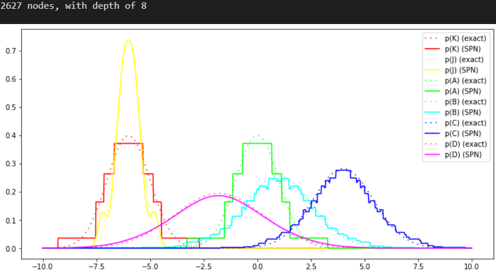
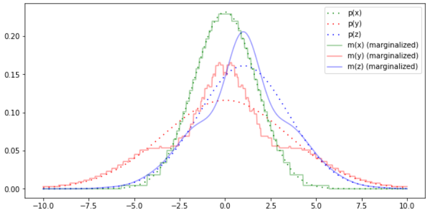

# Contains different explorative notebooks I've used to learn and build this extension

Defining a PGM is pretty easy. Here's a simple example. 

```python	
A = "A" @ noise  # noise is an i.i.d. gaussian with mean 0 and variance 1. The @ operator assigns a name to the variable.
B = "B" @ (A + 1.2*noise + 1) # They can be composed with other variables, and more noise can be added.
C = "C" @ (A + noise + 4)
D = "D" @ (B + 0.3*C + noise - 5)

K = "K" @ (noise - 6)
J = "J" @ (0.5 * K - 3 + 0.2*noise)
A & K # Here, we join the two pgms, which have no connecting edges between them.
display(A.get_graph(detailed=False))
display(A.get_graph(detailed=True))
```


We can construct an SPN approximating this multivariate normal with the following code.

```python
spn = spnhelp.pgm_to_spn(A, eps = 0.1) # eps can be lowered to get a better approximation
spnhelp.plot_marginals(spn, A)
print(get_number_of_nodes(spn), "nodes, with depth of", get_depth(spn))
```



Now, let's try and sample from it to see how well it captures the covariance:

```python	
scope = A.get_scope(across_factors=True)
print(K.get_Σ()) # printing the true covariance 
print(A.get_Σ()) # printing the true covariance
samples = spnhelp.sample_from_spn(spn, 10000) # sampling from the spn
cov = np.cov(samples, rowvar=False).round(1) # computing covariance of the samples
print(pd.DataFrame(cov, index=scope, columns=scope))
```


The covariance is pretty close to the true covariance. It would be better with a lower epsilon, but this is just a toy example and it grows exponentially in size with decreasing epsilons. The mean will be captured perfectly (not shown here).


# random stuff leftover from old readme, might remove later


Here's a discretized pdf of a normal distribution, constructed as a mixture of non-overlapping uniform distributions, created with `fit_spn_to_gaussian_eps(mean = 0, sd = 1, eps = 0.05, scope = 0)`.


This can be used again to construct multivariate distributions, by taking the products and weighted sums of the pdfs of the individual variables.

Below is a plot of increasingly discretized pdfs of a normal distribution, using no discretization, discretization of one axis, and discretization of both axes, created with some variant of `fit_spn_to_2d_gaussian(np.array([0.3, -0.5]), np.array([[1, 0.4],[0.4, 2]]), 0.03, [0, 1])`.


They produce increasingly inaccurate approximations of the original pdf, but marginalization, conditioning, map estimates, moments, KL divergece, (conditional) likelihood and other operations can be performed on them easily with zero knowledge of gaussians, which might be useful in some cases.

Here's a fun, not super accurate approximation. Was just a fun thing I took a screenshot of.


